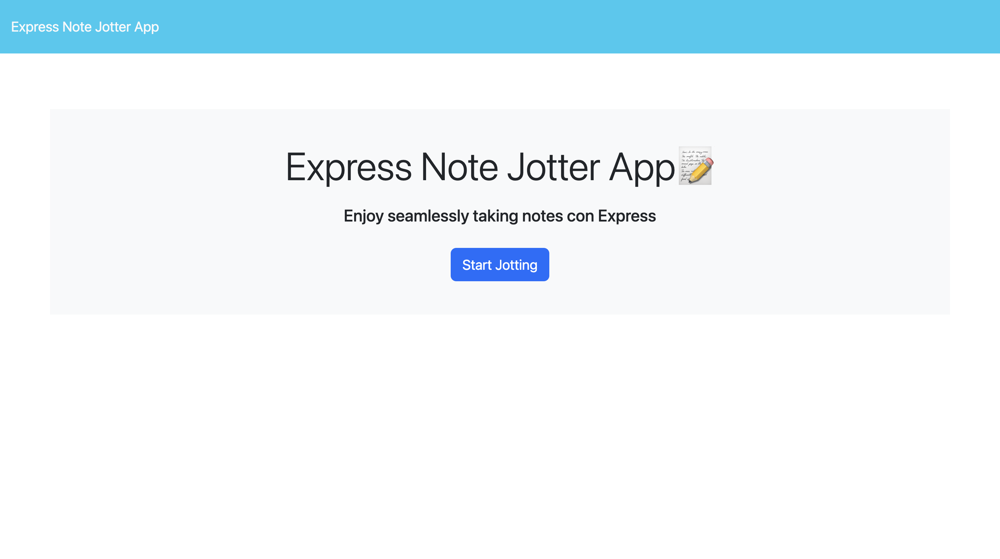
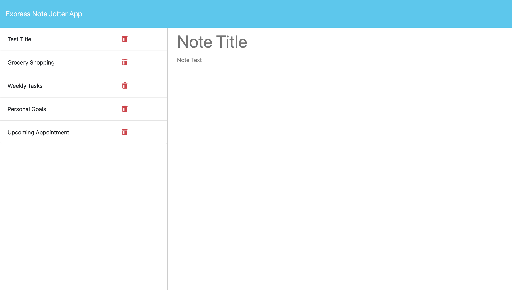
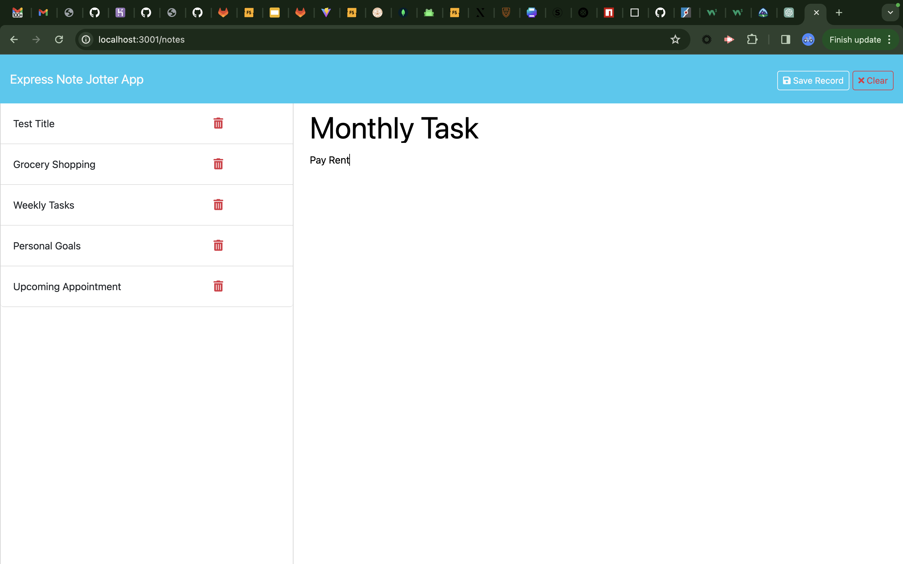
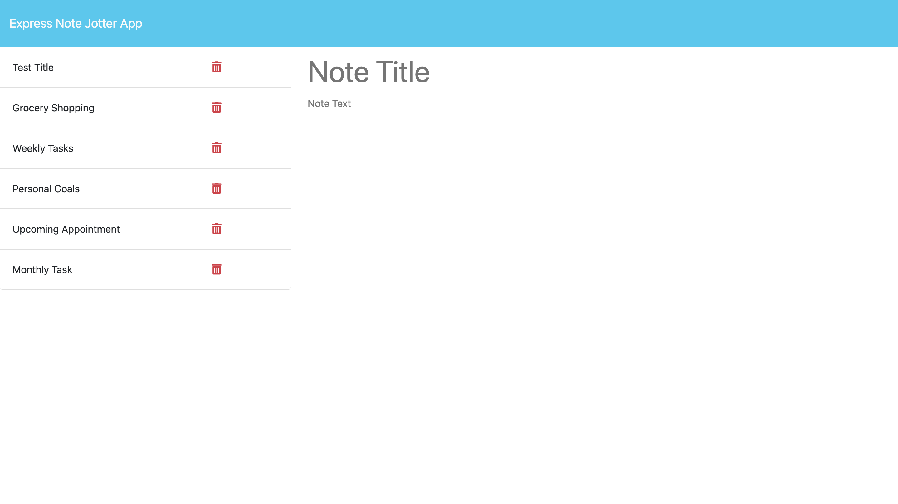
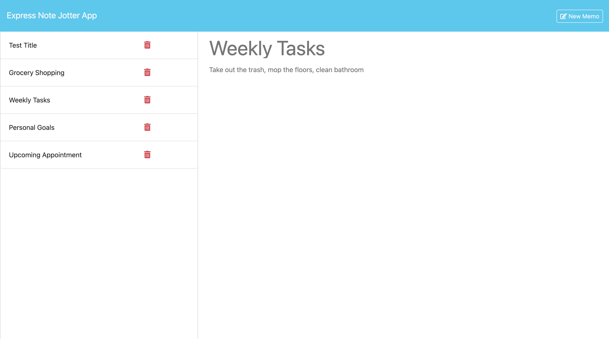
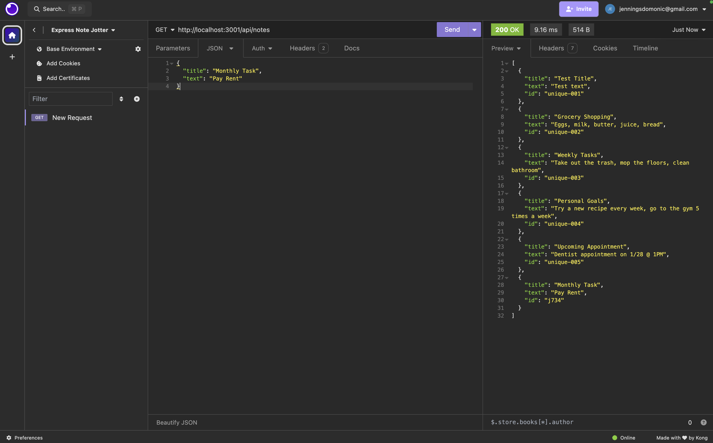
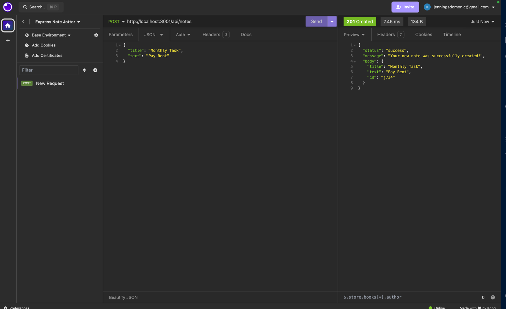
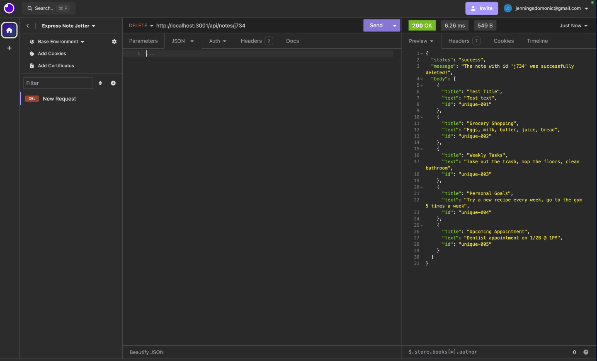

# expressnotejotterapp
A swift and intuitive solution for capturing and organizing your notes on-the-go

## Description 
This application is designed for jotting down, reviewing, and erasing notes.  

The purpose of this venture is to craft API endpoints using the Express.js server framework in conjunction with Node.js and to ensure the application is live on [Heroku](https://devcenter.heroku.com/articles/getting-started-with-nodejs). 
  
The `routes.js` file encompasses the following endpoints:  
- A GET endpoint to deliver all stored notes to the user:  
`app.get('/api/notes', (req, res) => {...});`

- A POST endpoint to accept a new note from the user's input, incorporate it into the `db.json` file, and then relay the added note back to the user:  
`app.post('/api/notes', (req, res) => {...});`

- A DELETE endpoint to erase a specific note identified by the id parameter from the `db.json` file, followed by transmitting the refreshed list of notes to the user: 
`app.delete('/api/notes/:id', (req, res) => {})`

- An HTML endpoint to provide the `notes.html` page: 
`app.get('/notes', (req, res) => {...})`

- An HTML endpoint for default requests, serving the `index.html` page: 
`app.get('*', (req, res) => {})`  

## Table of Contents 
- [Installation](#installation)
- [Dependencies](#dependencies)
- [Usage](#usage)
- [Testing](#testing)
- [Contributing](#contributing)
- [License](#license)
- [Questions](#questions)

## Installation 
No setup is required to use the app. Simply access the live version [here](https://jotter-app-4d7834aa2556.herokuapp.com/) to begin! 

To operate the app on your own system, please follow these instructions:
1. Download a copy of this repository onto your computer. (Guidance on repository duplication can be found in the [Cloning a Repository](https://docs.github.com/en/repositories/creating-and-managing-repositories/cloning-a-repository) GitHub Docs article.)
2. Execute `npm install` in your command line interface to install required npm packages.
3. Launch the server by entering `node server.js` into your command line interface.
4. Navigate to `http://localhost:3001` in your web browser to view the app locally.

## Dependencies
This project requires the following npm package dependencies:
1. [Express](https://www.npmjs.com/package/express)
2. [generateUniqueId](https://www.npmjs.com/package/generate-unique-id)

## Usage 
Once the user has opened them [ExpressNoteJotterApp](https://jotter-app-4d7834aa2556.herokuapp.com/) application, they will see the landing page with a button to "Start Jotting".  
  
  
After clicking the "Start Jotting" button, the user will be presented with a page that shows the existing notes listed in the left-hand column, plus empty fields to enter a new note title and the note’s text in the right-hand column.  
  
  
When the user enters a note title and note text, buttons to "Save Note" and "Clear Form" will appear at the top of the page. The "Clear Form" button will erase the entered title and text from the right-hand column.
  
  
After pressing the "Save Record" button, the newly created note appears in the left-hand column with the other existing notes, and the buttons in the navigation will disappear.  
  
  
The user can view the other existing notes by clicking on the respective note item in the left-hand column. The image below shows the user viewing the note titled "Weekly Tasks".  
  
  
If a note is no longer needed, the user can click the red trash icon for the note and delete. The corresponding note will be removed from the list. 
  
## Testing 
The API routes in this application were tested with the [Insomnia](https://docs.insomnia.rest/) development platform. Please refer to the [Installation](#installation) section if you are interested in running and testing the application locally. 

### GET  

The image above shows the response of the GET request to the `/api/notes` endpoint.

### POST  
  
The image above shows the response of the POST request to the `/api/notes` endpoint, given the request body shown below. The id for the note is generated using the [generate-unique-id](https://www.npmjs.com/package/generate-unique-id) npm package.

```
{
	"title": "Monthly Task",
	"text": "Pay Rent"
}
```
```
{
    "status": "success",
    "message": "Your new note was successfully created!",
    "body" {
        "title": Monthly Task",
        "text": "Pay Rent",
        "id": "j734"
    }
}
```
### DELETE  

The image above shows the response of the DELETE request to the `/api/notes/:id` endpoint, given the id paramater `j734`.

## Contributing
To make contributions to this project:  
1. Fork the repository  
2. Make some commits to improve the application
3. Open a Pull Request on GitHub
4. From there, we can discuss your changes and merge the pull request once your contributions have been approved!

## License 
[](https://opensource.org/licenses/MIT)
This GitHub repository is licensed under the MIT license. Please refer to the license documentation [here](https://opensource.org/licenses/MIT).

## Questions
This project was created by [Domj1204](https://github.com/Domj1204).  
For any related questions, please contact me via email at <jenningsdomonic@gmail.com>.
